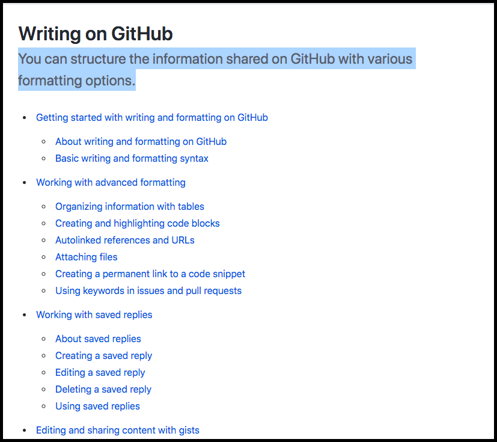

# Table of Contents
[Introduction to GFM](#introduction)

[Writing in GITHUB](#writing-in-github)

# Introduction
GitHub Flavored Markdown, often shortened as GFM, is the dialect of Markdown that is currently supported for user content on GitHub.com and GitHub Enterprise.
This formal specification, based on the CommonMark Spec, defines the syntax and semantics of this dialect.
While GFM supports a wide range of inputs, it’s worth noting that GitHub.com and GitHub Enterprise perform additional post-processing and sanitization after GFM is converted to HTML to ensure security and consistency of the website. :smile:

# Writing in GITHub
Below is the screenshot of the content. 

**_Note: Image names must not have space(s)._**

# Emojis

| Emoji | Syntax |
| ------- | -------- |
| Smile | :smile: |
| Wink | :wink: |
| Laugh | :rofl: |

# References
[Click here to refer the manual](DDSYOverview.pdf)

[Click here](Testing.html)

# Links
[Link #1](https://github.github.com/gfm/)

[Link #2](https://guides.github.com/features/mastering-markdown/)
